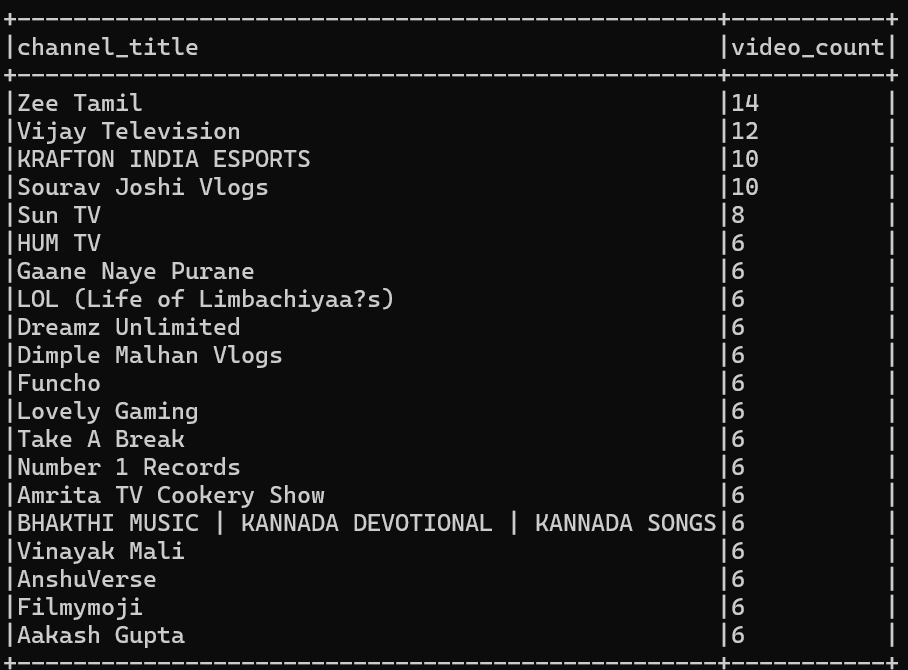
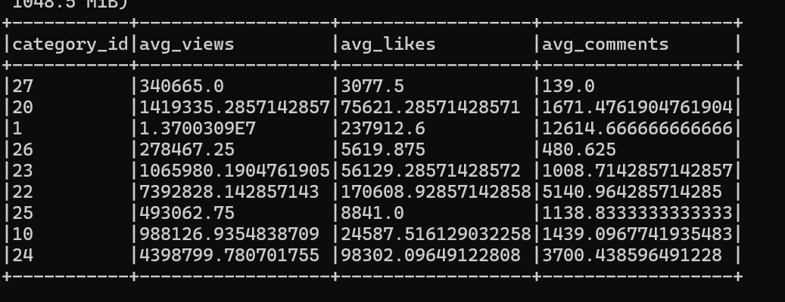

## Real-Time YouTube Trending Video Analyzer (India)

This project tracks **real-time trending YouTube videos in India** using the YouTube Data API and a big data pipeline built with **Apache Kafka**, **Apache Spark**, and **Docker**. It collects, processes, and displays insights like most viewed categories, top active channels, and trending video titles using **windowed aggregations**.

---

## Features

- Real-time ingestion of trending videos using the YouTube Data API
- Apache Kafka for message streaming
- Apache Spark Structured Streaming for windowed processing
- Containerized with Docker & Docker Compose
- Output includes:
  - Most viewed categories
  - Most active channels(based on the videos trending at that time frame of data ingestion)
  - Top trending video titles

---

##  Tech Stack

| Layer                           | Technology                               |
|--------------------------------|------------------------------------------|
| Data Ingestion                 | YouTube Data API, Python                 |
| Stream Pipeline                | Apache Kafka, Apache Spark               |
| Deployment                     | Docker, Docker Compose                   |
| Storage                        | HDFS (planned for scale-up)              |
| Visualization                  | To be added (React + Express dashboard)  |
| Sentiment Analysis of Comments | Planned for future implementation        |

---

1. **Kafka Producer** (Python):
   - Calls YouTube API periodically 
   - Pushes video metadata (title, views, category, channel, ...) to Kafka topic

2. **Spark Structured Streaming**:
   - Reads data from Kafka
   - Applies time-windowed aggregations
   - Displays top trending videos by category and channel

3. **Storage (HDFS & Hive)**:
   - Writes the processed output from Spark into HDFS
   - Stores structured data in Hive tables for querying and historical analysis
  
4. **Frontend Dashboard** *(Future Work)*: [TO BE IMPLEMENTED]
   - interactive web interface using **React + Express**
   - Visualize live and historical trends by video category, region, and channel

     
